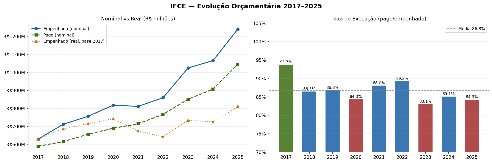
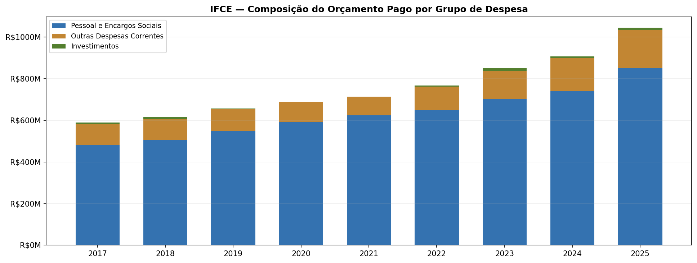
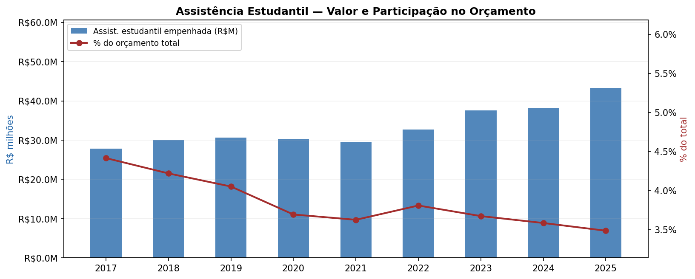
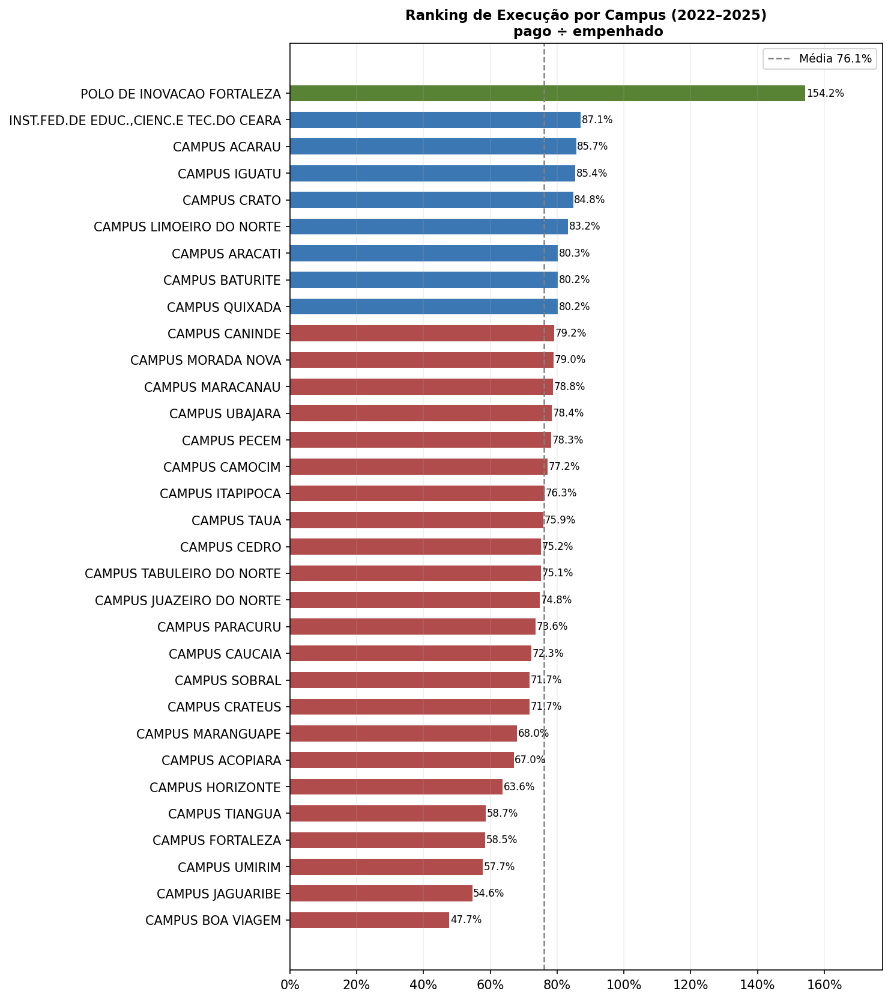
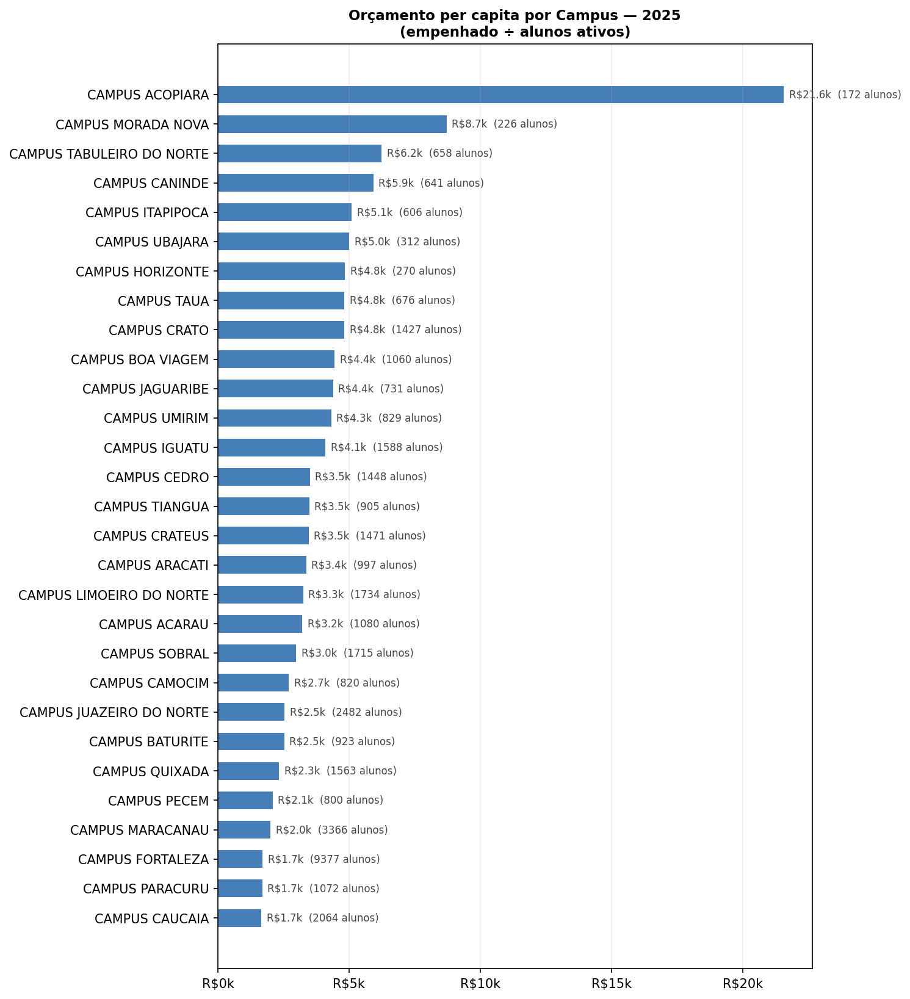
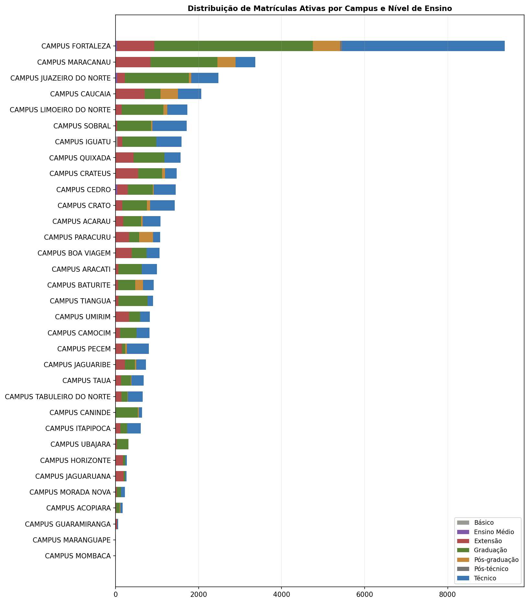

# Análise Orçamentária do IFCE (2017–2025)

Projeto de análise exploratória da execução orçamentária do **Instituto Federal de Educação, Ciência e Tecnologia do Ceará (IFCE)**, integrando dados do Portal da Transparência com informações de matrículas e deflação pelo IPCA.

---

## Sumário

- [Motivação](#motivação)
- [Estrutura do repositório](#estrutura-do-repositório)
- [Dados](#dados)
- [Como executar](#como-executar)
- [Visualizações geradas](#visualizações-geradas)
- [Principais achados](#principais-achados)
- [Limitações e ressalvas](#limitações-e-ressalvas)
- [Dependências](#dependências)

---

## Motivação

O orçamento público federal é uma das principais fontes de informação sobre as prioridades de uma instituição. Este projeto busca responder:

1. Como evoluiu o orçamento do IFCE em termos reais entre 2017 e 2025?
2. Qual a eficiência de execução (pago/empenhado) ao longo do período?
3. Como se distribui o gasto entre pessoal, custeio e investimento?
4. A assistência estudantil ganhou ou perdeu peso relativo no orçamento?
5. Há disparidades significativas de execução e custo por aluno entre os campi?

---

## Estrutura do repositório

```
.
├── notebook.ipynb        # Notebook principal (análise completa)
├── outputs/
│   ├── portal_transparencia_clean.parquet
│   ├── alunos_por_campus.csv
│   ├── ipca_base2017.csv
│   ├── fig1_evolucao.png
│   ├── fig2_grupos_despesa.png
│   ├── fig3_assistencia.png
│   ├── fig4_ranking_campus.png
│   ├── fig5_percapita.png
│   └── fig6_matriculas.png
└── README.md
```

> **Nota:** os arquivos CSV do Portal da Transparência e o arquivo de matrículas não estão versionados neste repositório por conta do tamanho. Veja a seção [Dados](#dados) para instruções de obtenção.

---

## Dados

### Portal da Transparência

- **Fonte:** [portaldatransparencia.gov.br](https://portaldatransparencia.gov.br)
- **Período:** 2017 a 2025
- **Filtro aplicado:** despesas do IFCE (UG vinculadas ao CNPJ da instituição)
- **Formato:** CSV com separador `;`, padrão do Portal
- **Nomenclatura esperada:** `transparencia_YYYY.csv` (ex.: `transparencia_2022.csv`)

### Matrículas

- **Fonte:** Sistema Acadêmico do IFCE / SISTEC
- **Arquivo:** `ifce-matriculas.csv` (separador TAB)
- **Conteúdo:** snapshot das matrículas ativas no momento da extração
- **Colunas utilizadas:** `desc_instituicao`, `sit_matricula`, `cod_matricula`, `modalidade_ensino`, `nivel_ensino`

### IPCA

Valores embutidos no notebook com base nos dados do IBGE. Índice acumulado com base fixa em 2017 = 1,000.

| Ano | Fator |
|-----|-------|
| 2017 | 1,000 |
| 2018 | 1,037 |
| 2019 | 1,058 |
| 2020 | 1,102 |
| 2021 | 1,202 |
| 2022 | 1,338 |
| 2023 | 1,396 |
| 2024 | 1,470 |
| 2025 | 1,530 |

---

## Como executar

### Pré-requisitos

```bash
pip install pandas numpy matplotlib pyarrow
```

### Passos

1. Clone o repositório e acesse a pasta do projeto.
2. Coloque os arquivos `transparencia_YYYY.csv` e `ifce-matriculas.csv` na raiz do projeto (ou ajuste os caminhos no notebook).
3. Abra o notebook no Jupyter ou Google Colab:

```bash
jupyter notebook notebook.ipynb
```

4. Execute todas as células em ordem. Os arquivos intermediários (`.parquet`, `.csv`) e as figuras (`.png`) serão gerados automaticamente.

---

## Visualizações geradas

| Arquivo | Descrição |
|---------|-----------|
| `fig1_evolucao.png` | Evolução do orçamento nominal e real + taxa de execução anual |
| `fig2_grupos_despesa.png` | Composição do valor pago por grupo de despesa (barras empilhadas) |
| `fig3_assistencia.png` | Valor absoluto e participação relativa da assistência estudantil |
| `fig4_ranking_campus.png` | Ranking de execução orçamentária por campus (2022–2025) |
| `fig5_percapita.png` | Orçamento empenhado per capita por campus no ano mais recente |
| `fig6_matriculas.png` | Distribuição de matrículas ativas por campus e nível de ensino |

### Figuras

1. **Evolução do orçamento**  
   

2. **Composição por grupo de despesa**  
   

3. **Assistência estudantil**  
   

4. **Ranking por campus**  
   

5. **Orçamento per capita**  
   

6. **Distribuição de matrículas**  
   

---

## Principais achados

- **Crescimento real do orçamento:** entre 2017 e 2025, o orçamento nominal mais que dobrou; mesmo deflacionado pelo IPCA, o crescimento real é positivo, indicando expansão efetiva da instituição.
- **Boa taxa de execução:** média de **86,8%** no período, com todos os anos acima de 83%.
- **Pessoal domina o orçamento:** o grupo "Pessoal e Encargos Sociais" representa mais de 70% do total pago em todos os anos analisados.
- **Assistência estudantil perde peso relativo:** embora os recursos absolutos tenham crescido, a participação relativa caiu de ~4,4% (2017–2018) para ~3,5% em 2025 — o crescimento orçamentário foi puxado principalmente por outras rubricas.
- **Heterogeneidade entre campi:** a taxa de execução varia de ~48% (Campus Boa Viagem) a ~154% (Polo de Inovação Fortaleza, que inclui pagamento de restos a pagar de exercícios anteriores). O orçamento per capita varia de R$ 1,7k (campi grandes como Fortaleza e Caucaia) a R$ 22k (Campus Acopiara, menor em número de alunos).

---

## Limitações e ressalvas

- **Snapshot de matrículas:** o arquivo de matrículas representa um único momento no tempo e pode não corresponder exatamente ao período fiscal do orçamento. O *per capita* deve ser interpretado como aproximação.
- **Campus com menos de 100 alunos:** excluídos da análise *per capita* para evitar distorções de denominador pequeno.
- **Polo de Inovação Fortaleza:** taxa de execução acima de 100% indica pagamento de restos a pagar de exercícios anteriores, não necessariamente ineficiência ou erro de dados.
- **IPCA 2025:** valor estimado, sujeito a revisão conforme divulgação final do IBGE.
- **Cobertura de campi:** nem todos os campi aparecem em todas as análises — depende do cruzamento com a base de matrículas.

---

## Dependências

| Biblioteca | Versão mínima recomendada |
|------------|--------------------------|
| Python | 3.9+ |
| pandas | 1.5+ |
| numpy | 1.23+ |
| matplotlib | 3.6+ |
| pyarrow | 10+ (para leitura/escrita de Parquet) |

---

## Licença

Este projeto utiliza dados públicos do Portal da Transparência do Governo Federal (acesso livre, conforme Lei de Acesso à Informação – Lei nº 12.527/2011). O código é disponibilizado sob a licença **MIT**.
